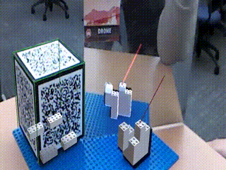
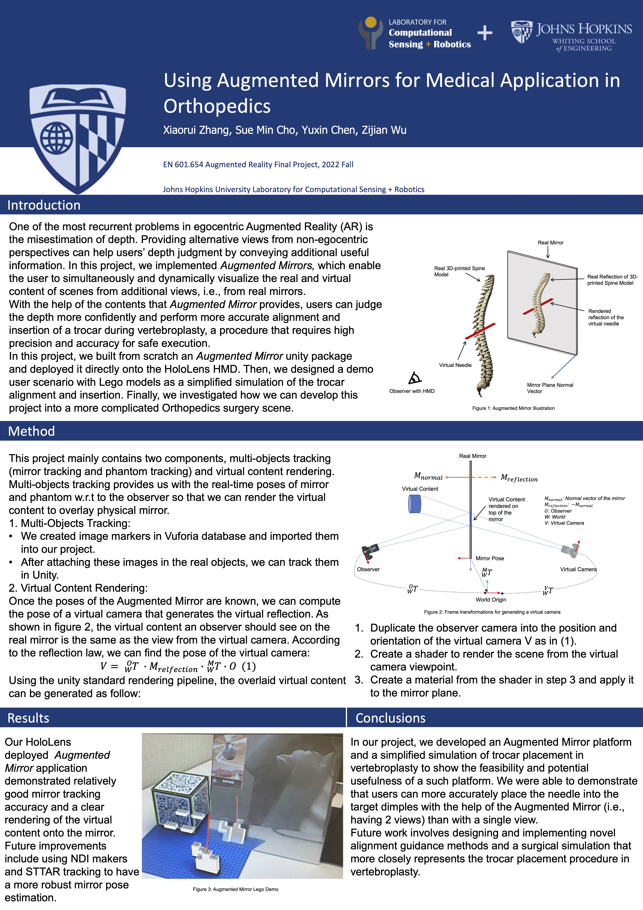
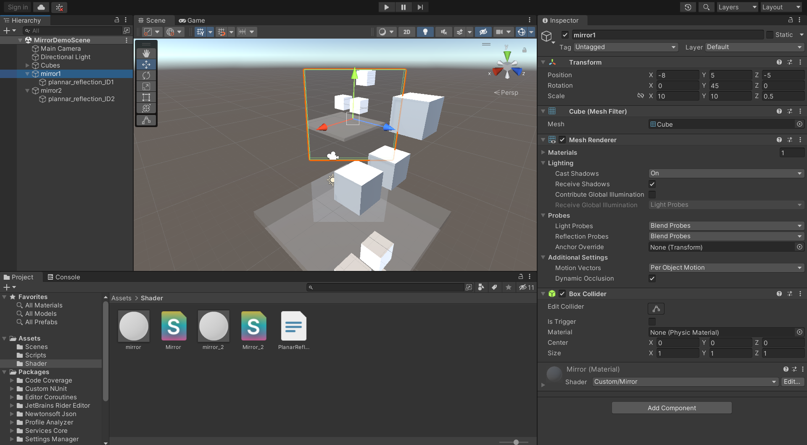
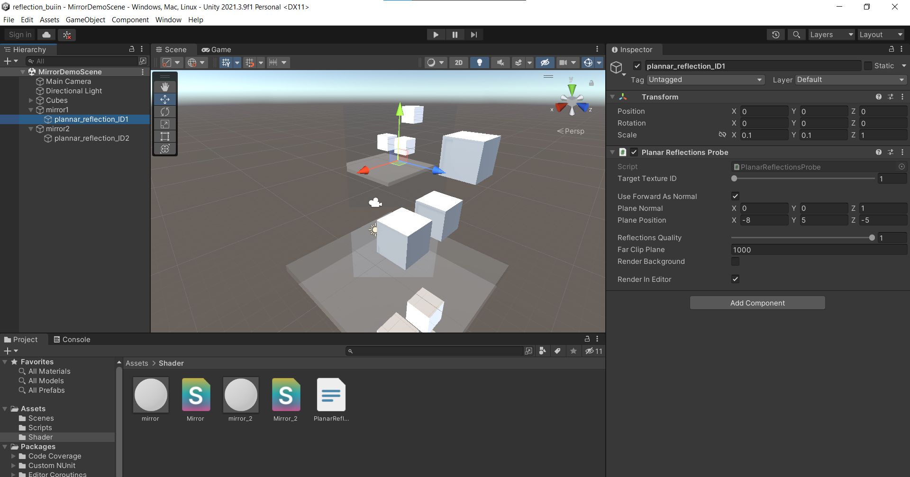

<h2 align="center">Augmented Mirror</h3>
<h3 align="center">EN.601.654 Augmented Reality</h3>
<h4 align="center">Johns Hopkins Computer Science / Robotics</h4>
<p align="center">
  
</p>
## Table of contents
- [Project Poster](#project-poster)
- [Getting started](#getting-started)
- [What's included](#whats-included)
- [Step by step guide to create an Augmented Mirror](#step-by-step-guide-to-create-an-augmented-mirror)
- [Acknowledgments](#acknowledgments)
  
## Project Poster
<p align="center">
  
</p>

## Getting Started:

This repo showcased how one can create an Augmented mirror easily with the help of [Vuforia](https://developer.vuforia.com/). Following the steps below and using the scripts and shaders provided in this git repo, any real mirror can be turned to augmented ones to enable users to dynamically visualize both real and virtual contents from it. 

## What's included
```text
Assets/
├── Scenes/
├── Scripts/
└── Shader/
```
####  Scenes: 
Our Lego demo scene is provided.
#### Scripts: 
* CameraControls.cs: This script enable users to move around using the keyboard. But it's not used in the demo since the camera/HMD is moving with the user directly.
* PlannarReflectionsProbe.cs: This script implements the augmented mirror and rendering the virtual mirror content to a custome texture. 

#### Shader:
Mirror_material.shader: This is the custome shader for generating the mirror texture. 
Mirror_material.mat: Material created from the mirror shader. 
  
## Step by step guide to create an Augmented Mirror:
We also provide a step by step guide for creating Augmented Mirror on any custom object:
- Create a new 3D core unity project. (Not URP)
- Add the camera control script (CameraControls.cs) to the main camera, this allows you to move the main camera with mouse and arrow keys. Enter the game mode, and try to move the camera, if works proceed to the next step. 
- Create your mirror objects, I used 3d cubes to represent mirrors. 
- Create an empty object (named plannar_reflection) under each mirror object.
- Attach the plannar reflection probe script (PlanarReflectionsProbe.cs) to the empty object. 
- Create a shader folder, Copy the mirror shader file (Mirror.shader) and Multi-shader compile file (PlanarReflections.cginc) into folder.
**PlanarReflections.cginc** helps us compile up to 4 mirrors at the same time, moreover, each mirror can have different shaders. 
**Mirror.shader** defines how to render the reflection through material. 
The following code define the shader ID, you can also change this in the inspector. 0 stands for the ID1, 1 stands for ID2. 
[KeywordEnum(One, Two, Three, Four)]
 _PRID("Planar Refl. ID", Float) = 0
- Create a mirror material out of the mirror shader. 
- Attach the material to the mirror object (Not to the plannar reflection object). 

- Make sure the script public variable in plannar_reflection object (child of the mirror object) has the same target texture ID as the shader you assigned to the mirror.
 
- Modify the script public variable in plannar_reflection object to have the same plane position, and plane norm as your mirror object. The position and norm are used to defiend where and how the reflection is rendered. When the mirror is tilted and the norm is hard to find, you can select the "use forward as Norm“ to auto detect the norm of the plane, and only specify the position would be enough. 
- The final step is to use [Vuforia](https://developer.vuforia.com/) to track the scene and the mirror simultaneously. We used a Multi-target to track the scene, and a 2D imgae target to track the Mirror. After the tracking is inplace, you can update mirror's position and normal vector in real-time to render the virtual content correctly.


## Acknowledgments
The Mirror reflection and Math derivation is inspired by:  
* [Plannar Reflection Youtube Video](https://www.youtube.com/watch?v=w84-l3IEhXM)

